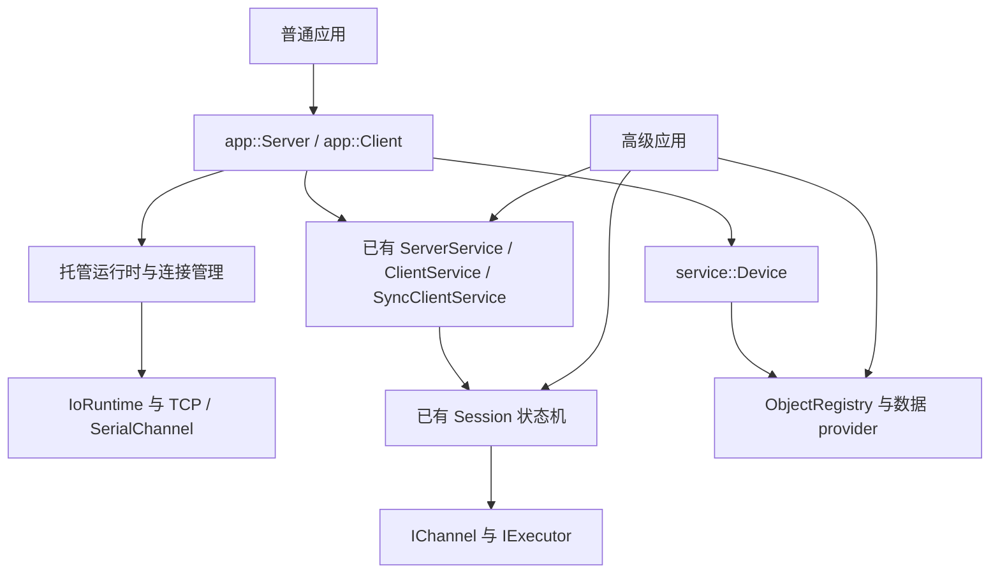

# DL/T 698 应用接口与易用性开发计划

编制日期：2026-10-07。实施更新：2026-10-07。状态：A/B/C/D 的服务器软件入口及 E 的客户端入口已交付；E 的高级扩展和 F/G 待实施。下文保留总体设计，具体已实现范围以本节及公开使用说明为准。

本批已实现 `service::Device`、`app::Server`、`dlt698::app` 目标和 `dlt698_server` 示例。支持运行中首次设置、标准结构校验、同 OI 多属性、自定义只读定义、元素更新、预算、原子快照、TCP 多会话与登录、串口自动适配、共享设备及确定性关闭。公开方法使用 `start_tcp/start_serial/set/stop/request_stop`，详见[托管服务器说明](../website/docs/session/server.md)。

实现调整：目录通过仅 Device 可调用的私有发布操作原子替换已校验 schema 和不可变 provider；公开重复注册行为不变。运行时新增 `finish()` 释放工作守卫，以在途 I/O 自然耗尽作为收尾条件；Session 新增关闭观察器。Windows 高层入口选用显式独占监听重载，旧监听默认保持不变。当前整数串行时序模型不能表达 1.5 停止位，高层入口对此明确拒绝。另修复了 MinGW 下 Asio 因包含顺序不同而混用有线程/无线程类型的静态链接崩溃，统一 transport 私有编译配置并恢复启用 TCP 回归。

客户端同步交付 `app::Client` 和 `dlt698_client` 配对示例：TCP/DNS 与串口、三种关联场景、直接 GET/SET/ACTION 及列表/记录、阶段超时、拒绝及 ERROR 原码、取消在途请求和确定性断开。Session 增加异步状态观察器，以事件通知串接 LINK/CONNECT；两端共用线程收尾器。CONNECT 拒绝映射为 `association_failed` 并保存 `remote_code`，预设关联不伪造 CONNECT 响应。详见[客户端说明](../website/docs/session/client.md)。

未交付部分：Device 的动态 provider/远端写权限、外部运行时、服务器拨号/客户端监听、自动恢复及工程单位输入。它们在 E/F/G 继续实施，原分层接口仍可用于高级业务。本批未验证成功的真实串口、RS-485 物理时序和独立设备互操作，不能据此宣称现场验收完成。

验证记录：MSVC 19.39 Release 共享/静态及 MinGW GCC 15.1 Release 静态、transport=ON 三组完整构建和 11 项 CTest 均通过，包含安装消费方、app 和恢复启用的 transport_tcp。MinGW 静态、transport=OFF 的 8 项也通过。新库与 device/app 测试分别通过 MSVC `/WX` 和 MinGW `-Werror`；现有测试有窄化转换、变量遮蔽或未使用函数告警，完整回归采用普通告警配置。TCP 测试显式执行 8 个用例、57 项断言通过，修正了其中未持有异步通道导致误跳过的生命周期。关闭观察器顺序及运行时自然排空取消完成另有测试。项目自身 C/C++ 全量 clang-format 检查、网站 typecheck/侧边栏检查/5 项侧边栏测试/文档构建通过，不将跳过或未执行用例算作通过。

目标：普通使用者通过创建服务器、设置点位、启动三个步骤完成接入；启动后可以继续设置和更新数据。连接接入、事件循环、协议登录、心跳、请求分发和资源关闭由库负责。需要深度定制时，仍可使用现有分层接口。

客户端验收补充：同样的 MSVC 共享/静态、MinGW 静态传输开启及关闭组合已完成构建/回归，安装 app 消费方增加客户端符号调用。app 集成测试新增 9 个客户端用例，含 400 行记录分块、实际远端 SET/ACTION、CONNECT/ERROR 原码、DNS 主机名、超时、取消、TCP 失败重试和释放通知；Session 状态观察器有异步顺序及异常隔离测试。独立进程配对运行 `dlt698_server` 与 `dlt698_client` 输出 `Frequency=5000 (unit: 0.01 Hz)`，两端正常收尾。真实串口及硬件验收不计入本记录。

本计划补充[原分层实现与 Python 发布计划](implementation-plan.md)，以现有 C++17 内核、[固定点位实现](standard-points-plan.md)和[支持矩阵](../docs/protocol-coverage.md)为基础。应用接口优先于继续扩充非必要点位和 Python 高层绑定；REPORT、PROXY、SECURITY 等协议建设仍按原计划推进，应用封装不把未实现能力标记为支持。

## 1. 问题与开发决策

| 当前问题 | 代码依据 | 本轮决策 |
| --- | --- | --- |
| `ServerService` 仅将 GET/记录/SET/ACTION 处理器绑定到已有会话 | [service.cpp](../cpp/src/service/service.cpp) | 新增完整服务器入口，保留现有分发器职责和名称 |
| 使用者必须管理运行时、执行器、accept、回调及退出循环 | [tcp_server.cpp](../cpp/examples/transport/tcp_server.cpp)、[tcp.hpp](../cpp/include/dlt698/transport/tcp.hpp) | 普通模式自动运行；高级模式可以注入外部运行时 |
| 设置数据必须创建 provider、填写或生成 schema，再注册目录 | [standard_points.cpp](../cpp/examples/service/standard_points.cpp)、[object.hpp](../cpp/include/dlt698/service/object.hpp) | 增加按 OAD 设置数据的设备对象，内部维护 provider 与 schema |
| TCP 示例每次进入 `serve()` 都重新创建目录，更新的数据随连接结束丢失 | [tcp_server.cpp](../cpp/examples/transport/tcp_server.cpp) | 数据归设备所有，所有连接共享；断线及停止监听不清空数据 |
| TCP 示例处理完当前连接才接受下一连接 | [tcp_server.cpp](../cpp/examples/transport/tcp_server.cpp) | 持续接受连接，各连接独立会话，并设置有限连接数 |
| 普通启动需要显式配置角色、登录、心跳以及串口链路适配 | [tcp_server.cpp](../cpp/examples/transport/tcp_server.cpp)、[rtu_server.cpp](../cpp/examples/transport/rtu_server.cpp) | 提供明确的连接场景配置，自动完成常规协议流程和串口适配 |
| 入门程序同时展示双端会话、虚拟时钟、方法、schema 和串行时序 | [quick-start.md](../website/docs/getting-started/quick-start.md) | 首屏提供最小真实服务端/客户端程序；高级组合独立展示 |

本轮交付重点是可直接使用的服务器和数据入口。底层状态机、分帧、GET Next、标准类型校验继续复用，避免维护第二套协议实现。

## 2. 范围、优先级与顺序

| 优先级 | 范围 | 完成条件 |
| --- | --- | --- |
| P0 | 设备数据入口、托管运行时、TCP 监听服务器 | 几行核心代码启动；运行中发布数据；客户端能读到更新；连接之间共享数据 |
| P0 | 串口服务器、基本配置、可靠停止、最小示例与安装包 | 同样的数据 API 可用于 TCP/串口；调用方不用手动驱动事件循环 |
| P1 | 完整客户端入口、标准值便利构造与高级扩展 | 客户端隐藏建连与 CONNECT；自定义 provider/方法/记录有清晰入口 |
| P1 | 服务器主动拨号、客户端监听接入、可选恢复连接 | 传输方向与协议角色独立；恢复不重放 SET/ACTION |
| P2 | Python 高层包装、工程值输入、长期稳定与性能验证 | 在 C++ 应用接口稳定后复用同一套生命周期和结果约定 |

首版数据入口接受精确 `model::Data`，不隐式猜测整数类型、数组布局、倍率或单位。真实采集、冻结调度、历史数据库及硬件控制由应用提供；需要这些功能的用户通过扩展接口接入。

## 3. 目标使用方式

### 3.1 最小 TCP 服务器

以下为目标 API 草案，名称在阶段 A 冻结。完整示例必须检查 `Result`，并在主程序中等待退出；等待应用退出是程序本身的职责，不能因此要求用户编写 I/O 驱动循环。

```cpp
#include <dlt698/app/server.hpp>

dlt698::app::Server server;
auto published = server.set({0x200F, 2, 0}, dlt698::model::UInt16{5000});
auto started = server.start_tcp("0.0.0.0", 6980);
// 检查 published 和 started；应用继续执行自己的业务。
auto updated = server.set({0x200F, 2, 0}, dlt698::model::UInt16{4998});
```

`200F/属性2/索引0` 使用已收录的频率标量定义，数值为协议原始值。数组型标准对象仍设置完整数组；例如三相电压必须使用三个 `UInt16` 元素，不能把标准电压整体错误注册成标量。

验收同时覆盖“先设置、后启动”和“先启动、后首次设置”。第一次成功设置一个标准属性后，它才对客户端可读；没有数据的属性返回未定义结果，不能自动填零。

### 3.2 串口服务器与共享设备

```cpp
auto started = server.start_serial("COM3", 9600);
```

TCP 与串口使用同一个 `Server::set`。一个服务器实例首版只启用一种传输；重复启动返回明确错误。需要同时提供 TCP 和串口时，多个 `Server` 显式共享一个 `Device`，不用复制数据或绑定回调转发。

```cpp
auto device = std::make_shared<dlt698::service::Device>();
dlt698::app::Server tcp(device);
dlt698::app::Server serial(device);
```

### 3.3 客户端目标

P1 增加 `app::Client`。`connect_tcp`/`open_serial` 成功表示必要的传输建立和协议关联已完成；随后可直接调用 `get/set/action`。返回值保留本地错误与远端 DAR，不用使用者再次创建 `Session` 或 `SyncClientService`。

## 4. 结构、依赖与兼容



模块约定：

- `Device` 放在 `service`，负责数据、定义、权限、校验与 provider，支持 `DLT698_BUILD_TRANSPORT=OFF`。
- `app` 负责组装服务、托管运行时和真实连接；新增 `dlt698::app` 构建目标，仅在启用 transport 时构建，并加入聚合链接目标 `dlt698::dlt698`。
- 新增 `dlt698/app/server.hpp`、`client.hpp` 和应用层聚合头 `dlt698/app.hpp`。保持现有 `dlt698/dlt698.hpp` 的 core 聚合职责，避免纯编解码调用方被迫引入网络模块。
- `service` 不反向依赖 `app` 或真实 transport。公开头文件不出现 Asio 类型，新增实现使用 PImpl 和对应导出宏。
- 现有 `Session`、`IoRuntime`、`ObjectRegistry`、`MemoryObject`、`ServerService`、`ClientService`、`SyncClientService` 保持原有默认行为。内部工作线程只由新的托管入口创建。
- 核心入口统一使用 `Result` 报告配置、类型、资源及 I/O 失败；构造函数仅沿用项目已有的程序错误异常约定。析构不抛异常。
- 普通接口不直接暴露可随意修改的内部目录。高级注册通过 `Device` 的受控接口，防止数据与 schema 不一致。

## 5. 数据 API 与发布语义

### 5.1 Device 职责

| 拟议接口 | 语义 |
| --- | --- |
| `Device::set(Oad, Data)` | 发布或更新标准属性的完整值；本地写入，默认仅允许特征零、索引零 |
| `Device::get(Oad)` | 本地读取已发布值或原始 DAR；数组元素索引复用现有规则 |
| `Device::set_element(Oad, Data)` | 显式更新已存在数组/结构的一级元素，不通过索引猜测整体长度 |
| `Device::define(ObjectSchema)` | 声明厂家自定义对象的类型和权限，随后复用本地数据存储 |
| `Device::register_provider(ObjectSchema, provider)` | 接入动态采集或业务后端；同一 OI 不与内存数据路径隐式混用 |
| `Server::set(Oad, Data)` | 转发到持有的 `Device`，提供普通用户的一步入口 |

首版 `Server::set` 仅需传 OAD 与值。设备接线、费率数及谐波范围等配置保存在 `DeviceOptions` 中，默认值明确记录；配置不符合实际设备时返回校验错误，不能自动补相、补费率或截断。

### 5.2 类型、权限与失败行为

1. 标准属性自动使用现有目录定义和严格结构校验。同一属性后续更新不能改变定义类型；自定义对象先 `define`，未知标准定义返回明确错误。
2. 不注册整份标准目录，不生成不存在的逻辑名、硬件值或业务功能。只公布已经成功设置或显式绑定的属性。
3. 本地 `set` 与远端协议 SET 分开：本地更新只读测量值合法，远端写权限默认关闭。标准允许写入且应用显式授权后，才可执行远端 SET。
4. 新值、定义、布局及资源预算先完整校验，再发布。失败保持旧值及已公布 schema 不变；并发读取只观察发布前或发布后的完整值。
5. 对一个 OI 先设置属性 2，再设置属性 3，必须扩充该对象，不能因重复 OI 而失败或覆盖已有属性。运行中首次设置也遵守相同语义。
6. 首版不提供运行中的删除、改类型、撤销权限或替换已有外部 provider；这些属于后续明确版本化的配置操作。

当前 `ObjectRegistry` 只有一次性对象注册，不能直接支撑第 5 条。阶段 B 必须实现受控的原子属性扩充：序列化 `Device` 内部配置更新，准备并校验尚不可见的新值，再发布新增 schema；失败清理未公布状态。必要时给目录增加显式的增量登记操作，保留现有 `register_object` 重复 OI 拒绝语义，并为该变化增加并发与失败回归。不可在示例里绕过目录校验解决。

### 5.3 生命周期、并发与预算

- `Device` 持有数据与 provider，`Server` 和连接持有共享引用。断线、重新接入、停止/重新启动同一个 `Server` 都保留数据；重新创建空设备不意味着磁盘持久化。
- 业务线程可以在服务运行期间调用 `set`。内置存储满足并发读写；自定义 provider 须按文档履行并发约定，用户回调在对象锁之外执行。
- 每次读取返回拥有内存的值快照。沿用现有 GET 分块快照，不在后续 GET Next 中重新读取新值。
- 首版保证单属性原子更新，不承诺跨属性/跨对象的事务一致性；若业务需要批量一致快照，后续另设显式接口。
- 限制已发布对象数、属性数、数据总字节及单值深度/元素/字节数；替换值按替换后的总量计算，超限不破坏旧值。

## 6. 运行时、连接与停止约定

### 6.1 默认托管模式

- 每个默认服务器拥有一个 `IoRuntime` 和一个工作线程。`start_tcp/start_serial` 返回前完成参数验证、资源准备及接收任务安装，调用方无需 `run_for`。
- `start_tcp` 成功表示本地监听和接受循环已就绪，不表示已有客户端，也不表示完成 LINK/CONNECT；后续连接状态通过可选事件通知。
- `start_serial` 成功表示串口打开、字格式配置及接收泵已安装。串口关联是否完成由连接场景决定。
- 启动失败回收已经打开的资源和工作线程，保留设备数据，允许纠正配置后重试。
- `stop()` 幂等：停止接受新连接、关闭所有会话和通道、处理取消/完成回调、结束运行线程。析构执行等价清理。
- 停止依据实际关闭完成与在途操作计数，不以固定 `run_for(20ms)` 或睡眠猜测完成。为此补齐现有底层所需的关闭完成观测，正常停止不提前 `IoRuntime::stop` 丢弃回调。
- 从服务器自己的回调调用阻塞 `stop()` 返回 `busy`，提供非阻塞 `request_stop()`；完成等待由外部线程进行。回调中释放最后一个公开句柄时，由独立运行控制状态收尾，禁止 self-join、悬垂访问或未经管理的 detach。
- 已接入的回调不阻塞等待同一个运行时；诊断、状态通知及 provider 异常被隔离，并通过明确错误路径呈现。

服务器状态固定为 `stopped → starting → running → stopping → stopped`。外部并发调用启动/停止的竞争返回 `busy`；`running` 表示传输入口在运行，会话关联状态逐连接保存。

### 6.2 TCP 与协议场景

- accept 持续运行，各连接创建独立执行器和 `Session`，共享设备数据。一个连接断开不影响其他连接，不因等待某个会话而停止接入。
- `ServerOptions` 首版默认最多 16 个活动连接；达到限制时关闭新增连接并通知资源限制。连接关闭后及时释放名额。
- 使用明确的场景枚举：`remote_public` 要求 LINK 预连接并使用公共 CONNECT；`local_public` 不要求远程 LINK，仍完成 CONNECT；`local_preset` 显式启用预设关联并要求双方配置一致。
- 默认 `start_tcp` 采用 `remote_public`，协议服务器在接入后自动发起 LINK 登录，默认心跳 5 秒；默认串口采用 `local_public`，关闭远程登录和心跳。这些是库的初始场景策略，不代表所有部署都必须如此。
- 默认协议地址沿用当前 `{0}` 和 CA=0，明确用于示例；真实接入通过 `ServerOptions` 设置地址、超时、资源限制及实际能力。设备通信地址属性与链路地址显式配置，不自动同步或静默反转字节。
- 登录失败或超时只关闭该连接，继续监听；错误事件包括连接标识、阶段和原因。现有心跳及关联状态机继续复用。
- TCP 监听/主动拨号与协议角色独立。P1 增加协议服务器主动拨号和协议客户机监听接入，不能用 socket 方向推断角色。

### 6.3 串口与高级模式

- 简单入口默认 9600/8E1，传入波特率时保留其余字格式默认值；高级选项可指定数据位、校验、停止位和流控。
- 自动根据实际字格式计算串行链路位数，并处理 FE 前导及帧间间隔。不能把 11 位写死用于所有端口配置。
- 自动方向适配器可使用估算时序；手动 RS-485 方向切换须接入真实排空回调，启动时验证配置完整性。软件测试和硬件时序验收分别记录。
- 高级模式允许注入外部运行时；此时不创建或停止外部线程，仅关闭本服务器拥有的会话、监听器和通道。外部运行时必须持续运行直到服务器关闭完成，文档明确所有权及等待方式。

## 7. 客户端、恢复连接与扩展

### 7.1 客户端入口（P1）

`app::Client` 持有运行时、通道和会话，复用异步内核及同步服务适配。首版提供同步 `connect_tcp/open_serial/get/get_list/get_record/set/action/disconnect`；连接完成标准与本地/远端结果明确分开。

- 建连阶段分别限制 DNS/TCP、LINK 等待和 CONNECT 时间；请求超时继续使用会话规则。
- 所有同步等待都有可完成的错误路径；事件循环内同步调用返回 `busy`。
- 单会话沿用一个在途事务，冲突返回 `busy`；首版不引入无界请求队列。
- 保留 DAR、CONNECT 拒绝码及 ERROR 原码。SET/ACTION 超时或断线明确表示远端执行结果可能未知。
- 断开时先结束关联和在途等待，再关闭传输；清理逻辑复用服务器阶段验证过的运行控制机制。

### 7.2 可选恢复连接（P1）

首个 P0 版本支持监听端持续接入和断线后重新连接，主动拨号的自动恢复在后续单独交付。恢复策略默认关闭，启用时采用有上限的退避、抖动、尝试次数/总时限及停止取消机制。

恢复重新创建通道和会话并执行必要的 LINK/CONNECT，旧请求完成为错误，禁止旧回调误配新请求。无论是否启用恢复，都不自动重放 SET/ACTION。GET 是否重试也必须显式选择，并记录可能改变的快照语义。

### 7.3 扩展入口

- 按 OI 注册 provider，保留完整 OAD/OMD/记录查询参数与原始结果。
- 方法绑定和记录后端作为独立高级示例，复用 `MemoryObject`、`MemoryRecords` 及已有标准记录验证。
- 运行时注入、时钟、诊断、状态事件与串口硬件 hooks 用具名选项；普通路径不要求传回调。
- 便利值构造先补标准数组与时间等精确 Data 构造。工程单位输入属于 P2，必须定义倍率、舍入、溢出和整数精度后再实施。
- 不从“提供了电能数值”推断设备真正具有计量能力；C.1 按已实现服务声明，C.2 保留应用显式声明。

## 8. 阶段任务与交付门槛

每阶段完成后记录构建组合、测试结果及尚未验证项；只有文档或 API 声明完成不算阶段交付。第一批任务状态如下，后续阶段保持未勾选。

| 阶段 | 依赖 | 主要工作 | 交付门槛 |
| --- | --- | --- | --- |
| A：冻结接口与行为 | 当前内核 | 明确 Server/Device 签名、场景、错误、预算与所有权；确认关闭完成和属性扩充所需底层变化 | 能从契约写出最小程序；所有失败/停止路径有确定行为 |
| B：设备数据入口 | A | 实现 Device、严格校验、原子属性扩充、并发更新及预算 | 启动前后首次发布均可用；同 OI 多属性；失败保持旧状态；transport=OFF 可用 |
| C：托管运行与 TCP 服务器 | B | 运行控制、关闭完成机制、持续 accept、多会话、自动登录和心跳 | 核心使用代码不超过 5 条语句；真实回环读取更新；多连接；确定性停止与重启 |
| D：串口与 P0 文档/安装 | C | 串口链路组合、字格式与 hooks、安装导出、最小示例、文档迁移 | TCP/串口共享数据 API；独立安装消费方通过；P0 验收完成 |
| E：客户端与高级扩展 | D | Client 入口、provider/方法/记录示例、外部运行时模式 | 同步客户端不手动驱动 I/O；错误码完整；高级模式所有权检查通过 |
| F：双向拨号与可选恢复 | E | 服务器拨号、客户端监听、有限恢复及取消 | 两种连接方向均完成协议服务；无副作用操作重放；停止后无重拨 |
| G：高层绑定与稳定 | E/F | 评估 Python 绑定、工程值入口及稳定性 | 与原 M9/M10 门槛合并验收，不另建协议内核 |

执行追踪：

- [x] A：冻结本批普通接口及后续高级接口边界，记录底层增量变更。
- [x] B：交付 Device、同 OI 多属性与运行中首次发布，补并发/失败测试。
- [x] C：交付托管 TCP Server、连接管理、登录与完整停止。
- [x] D：交付串口 Server 软件入口、安装目标和最小使用文档；真实串口及硬件时序待设备验收。
- [x] E 的客户端部分：交付 Client、配对示例、安装导出、原码/超时/取消/分块读取测试和文档。
- [ ] E 的高级扩展部分：外部运行时及自定义 provider/方法/记录接入示例。
- [ ] F：交付两种拨号方向和显式恢复策略。
- [ ] G：进入稳定接口与 Python 绑定评估。

推荐首先实施 A/B/C，形成一次可编译、可安装、可配对运行的 TCP 交付，再做 D。每次合并包含对应测试和使用说明，不把“易用性”验收延后到全部功能完成。阶段按依赖排序，工期在 A 完成后依据关闭机制和目录变更规模估算。

## 9. 拟议文件与文档迁移

| 路径 | 工作 |
| --- | --- |
| `cpp/include/dlt698/service/device.hpp`、`cpp/src/service/device.cpp` | 设备数据、定义、预算及 provider 接入 |
| `cpp/include/dlt698/service/object.hpp`、`cpp/src/service/object.cpp` | 受控的目录增量扩充，保留旧注册行为 |
| `cpp/include/dlt698/app/server.hpp`、`cpp/src/app/server.cpp` | 普通服务器入口、传输场景与数据转发 |
| `cpp/src/app/runtime.*`、`cpp/src/app/connection.*` | 私有运行控制、关闭收尾与连接管理 |
| `cpp/include/dlt698/app/client.hpp`、`cpp/src/app/client.cpp` | 高层客户端入口（P1） |
| `cpp/include/dlt698/app.hpp`、`cpp/app/CMakeLists.txt` | 新应用层聚合头与构建目标 |
| `cpp/include/dlt698/transport/tcp.hpp`、`cpp/src/transport/tcp.cpp` 等 | 必要的关闭完成观测；实现范围在 A 冻结 |
| `cpp/CMakeLists.txt`、安装配置及包消费方 | 导出 app 目标与公共头，验证静态/共享链接 |
| `cpp/tests/service/`、`cpp/tests/app/` | 数据契约、运行控制及真实传输回归 |
| `cpp/examples/app/` | 最小 TCP/串口服务端与客户端；独立的共享设备示例 |
| `README.md`、`website/docs/getting-started/quick-start.md` | 默认展示高层入口和错误处理，标注适用场景 |
| `website/docs/session/`、`website/docs/transport/` | 保留分层说明，增加普通模式与高级模式导航 |
| `docs/cpp-api.md`、`docs/m4-m5.md`、示例索引及支持矩阵 | 更新新入口、生命周期、依赖、实际验证与剩余范围 |

现有 codec/service/transport 示例继续保留并标为分层或高级示例。最小示例不夹带 ACTION、记录筛选、同步驱动或 RS-485 手动方向回调；高级示例单独展示。网站中现有 `cpp/examples/memory_mutation.cpp` 等过期路径按实际 `service/` 目录修正。

P0 示例必须展示完整的错误处理和退出方式，核心配置/设置/启动最多 5 条语句；统计不包含 include、main 包装、打印、结果检查和等待应用退出，但不得把手写连接/线程管理藏到示例辅助函数中。简短性来自已安装库的公开接口。

## 10. 验证与验收清单

### 10.1 行为验证

| 场景 | 必须证明的结果 |
| --- | --- |
| 先设置后启动、先启动后设置 | 两种顺序均可读；未发布时保留未定义结果 |
| 标准类型及布局错误 | 标量/数组、元素类型、数组长度、特征和索引被正确拒绝，旧值不变 |
| 同 OI 多属性与并发首次发布 | 不重复注册、不丢属性、不暴露未完成配置 |
| 业务线程更新、多个会话同时读 | 单值完整、不越界、不死锁；断线重接读到最后成功值 |
| GET 分块中更新源数据 | 当前查询继续使用原快照，新查询读取新数据 |
| 只读测量值本地更新/远端 SET | 本地更新成功，未经授权的远端写入被拒绝 |
| TCP 多连接与超限 | 至少两个连接可并行关联与读取；超限拒绝；关闭后名额可复用 |
| 登录失败与请求超时 | 该连接有明确错误结果，监听继续，其他连接不受影响 |
| 启动失败、停止、重新启动 | 端口/设备失败资源回收；数据保留；所有连接释放；无遗留线程 |
| 接入/读取/写入期间停止 | 在途任务有一次终结，关闭依据完成事件；无栈引用悬垂 |
| 回调请求停止/释放最后句柄 | 无 self-join、死锁、泄漏或析构后回调访问 |
| 外部运行时与多服务器共享设备 | 停止一个服务器不停止外部 runtime 或其他服务器，不清空共享数据 |
| 串口字格式与方向 hooks | FE、间隔参数随配置匹配；手动方向缺排空回调时明确失败 |
| 客户端本地错误/远端拒绝/执行未知 | 分别保留错误与原码；SET/ACTION 不被自动重放 |

数据与关闭状态机优先通过现有内存通道、虚拟时钟和可控失败注入验证，避免靠睡眠判定。TCP 用真实回环验证完整高层路径；硬件串口及独立设备互操作另列证据，不用内存测试替代。

### 10.2 构建、格式与分发

- C++17；MSVC 静态/共享和项目支持的其他工具链执行相关构建及测试。Windows 动态库新增导出符号、析构和安装消费方均需验证。
- transport=ON 时安装消费方仅链接 `dlt698::app` 或聚合目标，即可启动高层服务器；transport=OFF 时原 core/session/service 与新增 Device 继续可用。
- 增加真实 TCP app 集成测试，明确 network 标签与执行方式。本批已修复原 `transport_tcp` 禁用所对应的 MinGW 崩溃并恢复默认执行；两个网络测试都纳入常规 CTest。受限环境中仍须记录实际运行范围，不能把跳过的用例视为已验证。
- 若网络权限、迁移中的测试或工具链问题阻断检查，记录实际范围及原因；不把跳过、禁用或未执行的用例记为通过。
- 新增及修改 C/C++ 文件使用仓库根目录 `.clang-format`；对项目自身源码执行 `clang-format --style=file --dry-run --Werror`，排除 `third/`、构建目录及生成文件。
- 公开函数使用中文 Doxygen，说明类型/单位、参数方向、返回与错误、所有权、预算、异步回调和退出约定。关键实现增加中文协议、边界、状态迁移及并发说明。
- 源码 UTF-8，MSVC 安装目标继续向消费方传递 `/utf-8`。
- 修改网站文档时执行现有 `typecheck`、`check:sidebar`、`test:sidebar` 和 `build`；最小 C++ 示例从安装包编译，不能只检查 Markdown 渲染。

### 10.3 P0 完成定义

普通用户只需要包含一个高层头文件，设置必要地址/布局、发布数据并启动服务器；运行期间可以再次更新或首次发布属性。TCP 和串口均无需调用方创建执行器、会话、目录、监听回调或事件循环。数据跨连接保留，多连接和资源限制可验证，退出能完整清理，旧分层 API 仍可用。

本计划文件编写完成不代表 P0 完成；实施时必须逐项补齐上述证据，再更新状态和支持矩阵。
