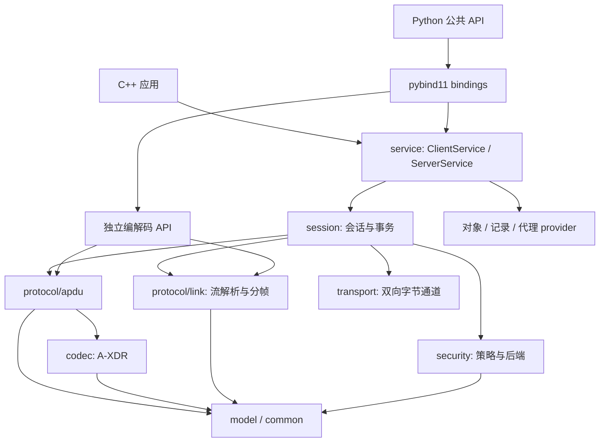

# DL/T 698.45 C++17 分层实现与 Python 发布计划

编制日期：2026-10-04。更新：2026-10-05。状态：M4 软件实现与 M5 两类分段/记录已完成；真实串口/RS-485 及独立设备互操作仍未验收。逐项证据见 [支持矩阵](../docs/protocol-coverage.md)。基线：本目录的 `dlt69845-2017.pdf`，DL/T 698.45—2017。

目标是先建立可独立使用、可测试、可安装的 C++17 协议库，再通过 pybind11 提供 Python API，最终交付可直接从 PyPI 安装的二进制包。实现顺序为：协议基础 → 通信与会话 → 完整服务 → 对象与安全完善 → C++ 稳定 → Python 绑定 → 分发发布。

## 1. 现状、依据与范围

### 1.1 仓库现状

- `dlt698` 在规划开始时只有 README、Apache-2.0 LICENSE、空的 `docs/` 和标准 PDF；当前实施状态以支持矩阵为准。
- 参考仓库为本地 `E:/github_project/dlt645`。已查看 `cpp/include/dlt645/`、主要公共接口、CMake、测试组织及 Python 构建与发布配置。
- `dlt645` 的 C++ 采用 `common / model / protocol / service / transport`，支持 TCP、串口、客户端和服务端，使用 C++17、CMake、Boost.Asio，已有安装导出及独立消费方测试。
- 本仓库使用用户提供的 standalone Asio 1.38.2（`third/asio/include`），作为可选传输模块的私有依赖；公开接口不暴露 Asio 类型。
- `dlt645` 的 Python 是独立实现、使用 setuptools 打包。698 的 Python 将绑定 C++ 内核，不能直接沿用其纯 Python 分发方式。

### 1.2 标准阅读与追踪原则

本次已结合 PDF 文本定位与页面渲染，重点核对帧格式、14 位长度域、HCS/FCS 范围、分帧确认、通用类型表、APDU 分类、GET 分块，以及安全附录。PDF 部分中文文本提取存在乱码；具体字段、表格和位定义以原始页面为准。实施时逐条整理规则及测试向量，不能直接把提取文本转换成代码。

计划中的页码均为标准印刷页码；例如标准第 6 页对应 PDF 第 9 页。主要依据：

| 标准位置 | 实现内容 |
| --- | --- |
| 第 4 章 | 通信架构、协议角色、请求/响应、通知/确认 |
| 第 5 章，第 5–10 页 | 帧格式、地址、HCS/FCS、串行传输、链路分帧 |
| 6.1、6.2，第 11–27 页 | 预连接、应用连接、服务过程、GET 分块过程 |
| 6.3.1–6.3.3，第 27–39 页 | A-XDR、基础及复合数据类型 |
| 6.3.4–6.3.16，第 39–63 页 | APDU、全部服务、安全、跟随上报、时间标签、异常响应 |
| 第 7 章，第 63–114 页 | 接口类、对象标识与属性/方法语义 |
| 附录 A、B、C | 校验算法、物理单位、一致性协商 |
| 附录 D | APDU 示例，作为独立预期值的主要来源 |
| 附录 E、F | 对象目录、状态字/特征字/模式字 |
| 附录 G、H | 安全认证规则及安全模式参数 |

只将 2017 版定义纳入默认协议配置。新版标准、国网扩展和厂家扩展分别建立 profile，待取得相应文档后实现，避免混入当前长度域、地址格式或服务语义。

### 1.3 对“完整”的可验收定义

用三个维度报告支持程度，分别给出覆盖表：

1. **线格式**：标准已定义的帧、Data、描述符和 APDU 分支均可编码、解码、验证；请求、响应、通知、确认均有独立测试。
2. **协议行为**：客户端和服务端支持会话、请求匹配、链路分帧、应用分块、上报、代理、安全策略、协商、超时和释放；能力声明与实际实现一致。
3. **对象能力**：标准对象目录及 schema 可查询，通用 GET/SET/ACTION 可扩展，首批常用对象提供真实的模拟语义；具体计量、存储、控制及硬件功能由应用实现 provider。

协议库提供设备接入和模拟框架。真实电能计量、物理开关控制、ESAM 芯片访问、厂家数据库和现场采集任务执行，需要接入相应硬件或业务后端。对象目录完整、报文可解析、设备业务已实现是不同状态，不能合并成一个完成标志。

首个可用版本覆盖 TCP/串口、协议客户机与服务器、普通 GET/SET/ACTION、常用对象和基础会话。它是里程碑，不代表全部标准完成。完整 C++ 阶段还包含 REPORT、PROXY、记录查询、两种分段机制、全部描述符和安全机制。

## 2. 分层架构

### 2.1 沿用与调整

| dlt645 的组织方式 | dlt698 的决策 |
| --- | --- |
| common、model、protocol、service、transport | 保留命名及客户端/服务端体验 |
| Frame 与 FrameStreamDecoder | 保留职责，重写 698 帧布局、地址、校验和流式恢复 |
| 以读写请求为中心的 Connection | 改为双向字节通道，由 session 处理请求、响应和主动上报 |
| 数据项表和模型 | 改为通用 Data + OI/OAD/OMD + 对象 schema/provider |
| Boost.Asio 传输实现 | 沿用异步通道设计，改用 standalone Asio，封装在可选 transport 目标中 |
| 同步接口与内部异步操作 | 使用统一异步核心，提供同步适配；同步调用限制明确 |
| CMake 安装包及消费方测试 | 保留并扩展为组件化导出 |
| Python 独立协议实现 | 改为绑定 C++，Python 只负责 API 适配与工具 |

### 2.2 模块职责

| 模块 | 职责 | 不承担的职责 |
| --- | --- | --- |
| `common` | 字节视图、Reader/Writer、错误、限制、日志接口 | 网络、对象业务 |
| `model` | Data、地址、描述符、APDU 值对象、结果、对象 schema | socket、线程、编码过程 |
| `codec` | A-XDR 长度、基础/复合类型、描述符编解码 | 会话状态、I/O |
| `protocol/link` | 帧编解码、HCS/FCS、流解析、扰码、分帧状态机 | GET 分块、业务执行 |
| `protocol/apdu` | 各类 APDU 的双向编解码、语法验证 | 请求队列、超时 |
| `session` | LINK/CONNECT/RELEASE、协商、PIID、路由、超时、两类分段的协调 | TCP/串口具体实现、对象存储 |
| `service` | ClientService、ServerService、记录/上报/代理、对象分发 | 原始字节解析、设备硬件细节 |
| `transport` | TCP 建连/监听、串口、字节读写、关闭、背压 | APDU 语义、DAR、请求匹配 |
| `security` | 安全封装、认证流程、后端接口、安全模式策略 | 计量业务、默认保存长期密钥 |
| `bindings` | pybind11 类型/API 绑定、异常与 GIL 管理 | 第二套协议实现 |



纯编解码模块不依赖 Boost、Python、日志库或运行时配置文件。`session` 通过 `IChannel` 与可注入的 executor/timer 使用传输能力；provider 和接口声明位于核心公共头文件，具体 I/O 实现位于 transport。

TCP 的连接发起方和协议客户机不是同一概念：采集终端可以主动拨入主站 TCP listener，而终端仍是协议服务器，主站仍是协议客户机。连接方式和协议角色分别配置、分别测试。

### 2.3 拟定目录与构建目标

```text
dlt698/
├── CMakeLists.txt                  # 仓库根入口，支持纯 C++ 和 wheel 构建
├── CMakePresets.json
├── VERSION                        # C++/Python 共用版本来源
├── pyproject.toml                 # 根目录构建，sdist 可自然包含 cpp/
├── cmake/                         # 包配置、依赖策略、安装规则
├── cpp/
│   ├── CMakeLists.txt              # 可单独构建，读取根 VERSION
│   ├── include/dlt698/
│   │   ├── common/ model/ codec/
│   │   ├── protocol/link/ protocol/apdu/
│   │   ├── session/ service/ transport/ security/
│   │   └── dlt698.hpp
│   ├── src/                       # 与公共模块对应，隐藏实现
│   ├── tests/                     # 单元、交互、传输、安装消费方
│   ├── examples/                  # 解帧、主站、终端、串口、记录、上报
│   └── fuzz/
├── bindings/                      # 按 model/codec/protocol/service 分文件
├── python/
│   ├── src/dlt698/                 # __init__.py、包装、.pyi、py.typed
│   ├── tests/
│   └── examples/
├── schemas/                       # 标准/厂家对象定义
├── tools/                         # schema 生成与测试向量检查
├── tests/vectors/                 # 两种语言共用、可追踪来源的向量
├── docs/                          # 架构、API、支持矩阵、互操作说明
├── plan/                          # 本计划与标准参考资料
└── .github/workflows/             # C++ CI、wheel CI、发布、文档
```

拟导出 `dlt698::core`、`dlt698::session`、`dlt698::service`、`dlt698::transport`、`dlt698::security`，以及聚合目标 `dlt698::dlt698`。目标之间的依赖在 CMake 中显式声明。

核心默认可独立构建，网络、绑定、示例、测试、安全后端均提供开关。使用 target 级 C++17、include、warning 和 link 设置，显式列出源文件；开发 CI 对项目代码严格警告，第三方头文件单独处理。

C++ 安装包支持静态/共享构建，明确导出宏、可见性及版本。Python 扩展默认链接启用 PIC 的静态内核，减少额外 `dlt698` 动态库装载要求。安全后端的外部动态库仍需单独检查、修复和测试。

## 3. C++17 数据与公共 API 约定

### 3.1 基础规范

- 使用 `std::uint8_t` 等定宽整数、RAII、`std::unique_ptr`、`std::optional`、`std::variant`、`std::chrono` 和 `enum class`。
- C++17 没有标准 `std::span` 或 `std::expected`：提供轻量只读 `ByteView` 和 `Result<T>`（含 `void`）；避免无必要的基础依赖。
- Reader/Writer 显式处理端序、长度及边界。禁止把字节流强转成 packed struct、原生枚举或浮点指针。
- 编解码以值对象返回结果；异步操作持有自己的缓冲区。跨回调、future 和 Python 边界不保留借来的 ByteView。
- session/service/transport 用 PImpl 隐藏实现与 Boost 类型。跨 DLL 使用的 C++ 值类型仍受编译器/运行库影响，不承诺跨工具链的 C++ ABI。
- 全局配置与 logger 不采用单例；配置、时钟、日志和安全/provider 按实例注入，便于多设备及测试。

### 3.2 通用 Data

`Data` 必须保存协议类型标记与精确值。`Unsigned8`、`Unsigned16`、`Enum`，以及 array/structure、octet/visible/UTF8 string 使用不同包装类型，不能只保留通用整数、字符串或数组。

递归 array/structure 使用包含 `std::vector<Data>` 的独立节点，以 C++17 支持的不完整类型规则实现，并在完整定义之后提供特殊成员实现。优先保持值语义，除非测量证明确有共享节点需求。

时间类型保留未指定/通配字段，不强制转成 `time_point`；编码不依赖宿主时区。bit-string 保存位数与位序，浮点明确 IEEE 格式和特殊值/重编码策略。未知 Data 标签不能假定有长度而直接跳过；返回明确错误，并在报文级诊断对象中保留原始字节。

### 3.3 错误与结果

错误至少区分：输入不足、非法长度/标签/值、HCS/FCS 错误、资源限制、地址/方向不匹配、会话未建立、请求超时、取消、连接关闭、协商失败、安全认证失败、能力不支持。

解析错误包含字节偏移与字段上下文。流解析区分 `NeedMoreData` 和真正无效的帧。协议远端返回的 DAR、ERROR-Response、安全结果保留原码；批量请求以每个对象的结果表示部分成功，不能压缩成单个 bool。SET/ACTION 超时需要标识“远端执行结果未知”。

### 3.4 公共入口草案

以下仅确定职责与使用方式，精确签名在 M0/M1 冻结：

| API | 用途 |
| --- | --- |
| `decode_frame / encode_frame` | 完整单帧编解码 |
| `FrameStreamDecoder::feed` | 连续字节输入，产出帧及诊断事件 |
| `decode_data / encode_data` | 独立 A-XDR Data 编解码 |
| `decode_apdu / encode_apdu` | 带 profile 与限制的 APDU 编解码 |
| `ClientService::get / set / action` | OAD/OMD 通用同步访问 |
| `get_list / get_record / get_next / get_md5` | 列表、记录、分块和标准 MD5 服务 |
| `async_get / async_set / async_action` | 同一事务核心的异步接口 |
| `ClientService::subscribe_reports` | 接收主动及跟随上报，配置确认策略 |
| `ServerService::register_object` | 注册 schema 与对象 provider |
| `ServerService::report / set_proxy_provider` | 上报发送及下游代理接入 |
| `attach_channel / connect_tcp / open_serial` | 协议角色与通道创建分别配置 |

串口可保留 `createRtuClient/createRtuServer` 的便捷别名以贴近 dlt645；文档明确这是 DL/T 698 串行通信，帧格式、时序和校验遵循 698。

## 4. 协议实现任务与支持矩阵

所有条目初始为“未实现”。实施时为每个子分支记录四项证据：类型模型、codec、客户端/服务端行为、独立测试。只有适用项全部通过才能标记完成。

### 4.1 链路与字节流

| 任务 | 要点 | 阶段 |
| --- | --- | --- |
| 帧格式与长度 | 68H/16H、长度域 2B；2017 版 bit0–13 表示长度、bit14–15 保留；长度不含起止字符 | M2 |
| 控制域 | DIR、PRM、分帧标识、SC、功能码及保留位校验；请求、应答、上报、确认方向分别测试 | M2 |
| 地址 | SA 描述字、1–16 字节地址、逻辑地址、CA；单地址、通配、组、广播及表示转换 | M2 |
| HCS/FCS | 按附录 A；HCS 覆盖 L/C/A，FCS 覆盖 L 到链路用户数据、包含 HCS；端序独立验证 | M2 |
| SC 扰码 | 按标准对指定数据部分做加/减 33H，与 CRC 顺序及分帧组合有专门向量 | M2/M5 |
| 增量解帧 | 半帧、粘帧、FE 前导、噪声、错误长度/校验、嵌入 68H/16H、流结束时残帧 | M2 |
| 串行传输 | 发送前 4 个 FEH；帧间至少 33 位时间；发送排队及 RS-485 收发切换策略 | M4 |
| 链路分帧 | 2B 分帧格式域、12 位序号、起始/中间/最后/确认帧、逐帧确认、循环与超时 | M5 |
| 资源限制 | 帧、缓存、重组总量、并行重组数、超时与缓冲回收均可配置 | M2/M5 |

流解码器需要有界缓存及可证明的恢复进度：损坏帧不能导致无限等待或反复扫描同一字节。声明长度合法但一直未收完整的输入，由通道/会话超时及 decoder reset 策略清理。

### 4.2 A-XDR 与描述符

| 类型组 | 内容 | 阶段 |
| --- | --- | --- |
| 基础编码 | 长度行列式、CHOICE、SEQUENCE、SEQUENCE OF、OPTIONAL；有/无 Data 标签的编码上下文 | M1/M3 |
| 标量 | NULL、bool、bit-string、8/16/32/64 位有符号/无符号整数、enum、float32/64 | M1 |
| 容器与文本 | array、structure、octet-string、visible-string、UTF8-string | M1 |
| 时间 | date_time、date、time、date_time_s、TI、TimeTag | M1/M3 |
| 对象 | OI、OAD、OMD、ROAD、TSA、Scaler_Unit | M1/M3 |
| 选择器 | RSD 全部分支、CSD、RCSD、MS 全部分支、Region | M5/M6 |
| 安全与通信 | MAC、RN、SID、SID_MAC、COMDCB | M6/M8 |
| 会话与结果 | PIID、PIID-ACD、DAR、ConnectMechanismInfo、ConnectResult、ConnectResponseInfo、一致性位图 | M3/M6/M8 |

按 6.3.2/6.3.3 建立完整标签清单，逐项检查边界、非法值、嵌套及独立字节向量。长度计算进行溢出检查，超过大小/深度/元素数限制时在分配前拒绝。值编码与类型标签编码分别建入口，避免将固定结构字段错误地按 Data 编码。

### 4.3 APDU 与服务

| 服务 | 覆盖分支及行为 | 阶段 |
| --- | --- | --- |
| APDU 外壳 | LINK、Client、Server、SECURITY 分别建模；TimeTag、FollowReport 依各自定义处理 | M3/M6/M8 |
| LINK | 登录、心跳、退出及响应时间信息；预连接与物理通道生命周期分开 | M3/M4 |
| CONNECT | 版本、协议/功能一致性、发送/接收帧限制、窗口、APDU 限制、超时与认证机制 | M3/M4/M8 |
| RELEASE | 请求、响应、服务器失效通知；释放时完成/取消在途请求 | M3/M4 |
| GET | Normal、NormalList、Record、RecordList、Next、MD5 请求/响应全部分支 | M3/M5/M6 |
| SET | Normal、NormalList、SetThenGetNormalList；逐项 DAR、延迟读和部分成功 | M3/M6 |
| ACTION | Normal、NormalList、ActionThenGetNormalList；可选返回值、逐项结果 | M3/M6 |
| REPORT | NotificationList、RecordList、TransData，以及三类 Response；确认、重发、去重 | M6 |
| PROXY | GetList、GetRecord、SetList、SetThenGetList、ActionList、ActionThenGetList、TransCommand 及响应 | M6 |
| SECURITY | 明文/密文封装、验证信息各 CHOICE、失败 DAR、认证与安全模式 | M8 |
| 附加及异常 | FollowReport 两类结果、TimeTag 的有效性、ACD、双向 ERROR-Response | M3/M6/M8 |

GET 的单帧可解析应用分块与链路分帧由不同类实现。前者使用 GetRequestNext/GetResponseNext、block、lastblock；后者传输同一 APDU 的片段并做链路确认。还要测试两者同时启用的情况：一个 GET 分块 APDU 自身可再经链路分帧传输。

GetRequestMD5/GetResponseMD5 的算法及输入范围按标准定义，与安全认证能力分别处理。MD5 后端须满足目标平台的可用性，并以固定输入/预期摘要测试，不用 encode/decode 互相验证代替正确性证据。

### 4.4 会话、路由与并发

- 建立 `Disconnected → Preconnected → Associating → Associated → Releasing` 等状态，失败、过期、重连的转换有明确表格；串口预设应用连接按标准 profile 处理。
- 维护本地、对端及协商后限制；协议一致性 64 位、功能一致性 128 位按附录 C 建模，未实现能力不能宣告支持。
- PIID 请求序号按标准为 6 位。事务键包含会话/连接、SA、CA、服务及 invoke-id，响应还验证预期对象/方法或分块上下文。
- 首版每设备只保留一个在途请求；串口共享总线串行化。TCP 并发在有测试支撑后开放，始终受到协商窗口限制。
- 超时、取消或重连后隔离迟到响应。由于线上没有本地 generation 字段，序号回收必须结合有限等待期、对端超时或重建会话，不能仅靠内部计数防止误配。
- 接收泵持续读取，同时分发响应、心跳、RELEASE、REPORT 和 FollowReport；上报不能被普通同步请求吞掉。
- 使用单调时钟实现请求与重组超时，协议日历时间使用可注入的系统时钟。区分总事务、单次读写、分段、会话空闲及心跳超时。
- 重试按服务分类：读请求可配置；SET/ACTION 默认不自动重放，除非应用确认幂等策略。广播/组地址遵循无需应答的规则。
- 回调在明确的 executor 执行，内部锁释放后调用。回调异常隔离，队列有容量与背压策略。同步 API 禁止在同一 I/O 执行线程阻塞等待。
- `close/stop/cancel` 幂等；先停止事件生产，再结束请求和回调，再释放资源；析构及退出不会永久 join 或访问已销毁对象。

### 4.5 对象模型与业务能力

采用 `ObjectRegistry + ObjectSchema + IObjectProvider`。schema 定义 OI、接口类、属性号、索引、类型、访问权限、方法参数/返回、单位和倍率。读写操作返回精确 Data 与 DAR。记录另设 provider，执行 RSD/RCSD；代理另设 provider，路由 TSA 或透传端口。

标准目录与厂家扩展放在版本化 schema 中；生成器产出 C++ 静态表，生成结果入库、CI 检查漂移。C++ 消费方无需安装 Python 或读取 schema 文件。Python 查询同一 C++ 目录，避免两份定义漂移。

常用对象实现顺序：

1. 电能量、最大需量、实时电压/电流/功率及 scaler/unit。
2. 日期时间、通信地址、设备标识及串口/通信参数。
3. 事件、冻结、负荷记录与列选择、时间范围查询。
4. 档案、采集任务、上报配置和代理端口，按终端 profile 提供 provider 示例。
5. 标准第 7 章与附录 E/F 的完整目录及结构定义；厂家对象通过独立扩展注册。

便利 API 如 `read_voltage()` 返回原始值、倍率、单位和换算结果，内部调用通用 GET。目录未知但 Data 类型已知的 OAD 仍可通用访问；未知结构不能猜字段。记录字段缺失、DAR、整属性/索引语义与单位未知情况均显式表示。

### 4.6 安全实现与外部依赖

安全模块分成三层交付：

1. **模型与 codec**：认证机制、SID/RN/MAC、SECURITY 请求/响应、各验证分支、密文字节容器、失败结果；即使无硬件也能完成。
2. **协议策略与流程**：CONNECT 认证、会话安全上下文、对象安全模式、完整性校验先于业务执行、认证失败与挂起规则；规则依据 6.3.13、附录 G/H。
3. **真实后端**：`ISecurityProvider` 承接随机数、认证、MAC、加解密、会话密钥生命周期与 ESAM/主站模块访问；明确每种机制的后端及测试环境。

M0 先确定可获得的 ESAM/主站安全模块、SDK、算法/profile 和授权测试向量。软件后端只在算法、密钥使用和测试向量明确后选择成熟库实现，不把一个通用加密库等同于 ESAM 协议支持。

无安全后端时返回明确的 `SecurityProviderUnavailable/UnsupportedMechanism`，不宣告认证成功。mock 只用于流程测试。没有真实后端互操作证据时，安全对应条目保持“外部依赖待验证”，不能作为“完整安全支持”发布。

## 5. 分阶段工作包

各阶段含实现、必要测试、文档和支持矩阵更新；每阶段形成可构建交付物。下面的任务框用于执行追踪，尚未完成的实现全部保持未勾选。

| 阶段 | 依赖 | 交付物 | 通过条件 |
| --- | --- | --- | --- |
| M0 范围与工程基线 | 无 | 逐项覆盖表、规则清单、向量格式、API 草案、CMake/CI 骨架 | 三平台 C++17 编译；最小安装消费方通过；确定安全/设备联调资源 |
| M1 基础模型与 codec | M0 | ByteView、Result、Reader/Writer、Data、基础描述符、A-XDR | 基础类型及边界有独立预期向量；嵌套及资源限制通过 |
| M2 链路层 | M1 | Frame、地址、HCS/FCS、扰码、FrameStreamDecoder | 标准帧逐字节一致；任意切分/噪声/错误帧测试通过 |
| M3 基础 APDU | M1/M2 | APDU 外壳、LINK/CONNECT/RELEASE、普通/列表 GET/SET/ACTION | 各请求/响应独立向量通过；纯内存模拟交互闭环 |
| M4 传输与基础会话 | M3 | TCP、串口、Session、同步/异步 ClientService、基础 ServerService | 主站读写模拟终端；两种 TCP 建连方向；超时/关闭/回调测试通过 |
| M5 两类分段与记录 | M4 | 链路分帧、GET Next、Record/RecordList、完整选择器 | 双端分帧、丢失/重复/乱序、超时与组合分段通过；记录结果不丢类型 |
| M6 完整服务 | M5 | SET/ACTION then-get、REPORT、PROXY、MD5、ACD、FollowReport | 全部标准服务分支有 codec 和交互测试；上报与请求并行工作 |
| M7 对象与模拟器 | M3–M6 | schema、静态目录、providers、常用对象、命令行示例 | 目录条目可追踪；常用对象和记录的权限/类型/DAR/倍率验证通过 |
| M8 安全与互操作 | M4/M6，后端资源 | 全部安全 codec、策略、真实后端适配、互操作报告 | 安全分支覆盖；真实认证/安全读写通过；限制明确记录 |
| M9 C++ 稳定交付 | M0–M8 | 安装包、API 文档、支持矩阵、兼容与性能报告、候选版本 | 第 7 节 C++ 门槛通过，冻结拟绑定 API |
| M10 Python 绑定 | M9 | `_native`、公共包装、类型提示、异常、示例、测试 | Python 与 C++ 共用向量；线程/GIL/退出测试通过；API 对等 |
| M11 wheel 与 PyPI | M10 | 各平台 wheel、sdist、发布工作流、安装文档 | 清洁环境安装通过；sdist 独立构建通过；TestPyPI 验收 |

### M0–M4：首个可用 C++ 闭环

- [ ] 建立 `docs/protocol-coverage.md`：每个服务 CHOICE、Data 标签、RSD/MS 分支、对象族和安全机制单独一行。
- [ ] 建立 `tests/vectors/` 格式，包含来源章节/页码、原始 hex、预期树、错误偏移和人工复核状态。
- [x] 建立公共模型、错误体系、限制默认值及异步通道/executor/读取 provider 合约。
- [x] 补充 SyncClientService 及其等待、外部运行线程/显式驱动、事件循环内拒绝和关闭约束。
- [x] CMake 安装导出、纯 core 构建、MSVC/GCC/Clang CI 配置、CTest 和独立消费方示例（远程 CI 执行状态另见支持矩阵）。
- [ ] 实现 M1、M2，优先覆盖短 GET 报文及完整响应的独立解码/编码。
- [x] 实现 LINK/CONNECT/RELEASE/ERROR codec、公共/预设连接与普通/列表 GET。
- [x] 实现基础 Session：精确地址/方向/PIID/OAD 匹配、单在途、序号隔离、超时/取消/释放及闲置失效。
- [x] MemoryChannel + ObjectRegistry/MemoryObject + 异步 ClientService/ServerService 验证对象读取闭环，并接入 TCP listener/dialer，覆盖两种协议角色拨号方向。
- [x] 实现普通/列表 SET/ACTION codec、会话、写入/方法 provider、权限/类型检查及部分成功。
- [x] 接入原始 SerialChannel 和 SerialLinkChannel：FE 前导、33 位收发间隔、排空/方向驱动接口及虚拟时间测试。
- [ ] 使用实际串口/RS-485 设备验证收发、USB 排空、方向切换及物理间隔。
- [x] 实现周期心跳与 TimeTag 有效性；远端错误原码已保留。
- [x] 提供解帧工具及 memory_get 主站/终端内存示例，支持 CONNECT → 部分成功 GET → RELEASE。
- [x] 提供 memory_mutation 同步示例，经过串行前导/间隔适配执行 SET → ACTION → GET。
- [x] 提供独立 TCP/串口主站与终端模拟命令行示例；TCP 双向拨号及四类命令已软件验收，真实串口验收另列。

### M5–M9：完善 C++ 并冻结绑定面

- [x] 独立实现 LinkFragmenter/Reassembler 与 GetBlockTransfer，覆盖序号循环及重组回收。
- [x] 完成所有 RSD、MS、CSD/RCSD 分支和记录数据结果；明确快照/分页的一致性。
- [ ] 完成 then-get、三类上报及确认、七类代理及响应、MD5、FollowReport、ACD。
- [ ] 服务端实现记录、上报、代理 providers；能力协商与实际注册能力绑定。
- [ ] 生成标准对象目录，补齐首批对象语义、完整字段 schema 和厂家扩展入口。
- [ ] 完成安全 codec、真实后端接入和联调；外部资源未到位时继续其他工作但保留缺口。
- [ ] 畸形输入 fuzz、资源限制、并发/退出、内存检查、实际设备互操作及安装验证。
- [ ] 写 C++ API/线程/兼容性文档，完成版本与导出规范，发布 C++ 候选版本。

### M10–M11：Python 与分发

- [ ] 绑定模型、codec、服务、配置、诊断和 capability 查询。
- [ ] 加入显式 `Data` 工厂、Python 异常、上下文管理器和 `.pyi/py.typed`。
- [ ] 测试 GIL 释放/回调重入、关闭/GC/进程退出及对象存活期。
- [ ] 配置根 `pyproject.toml`、scikit-build-core、cibuildwheel 和 wheel 安装测试。
- [ ] 验证从 sdist、独立源码包及清洁机器构建；构建范围排除 plan PDF 和本地资料。
- [ ] TestPyPI 安装验收、Trusted Publishing 配置、版本一致性及发布材料检查。
- [ ] 发布阶段再使用实际确认的包名、版本和平台矩阵执行正式发布。

## 6. Python API 与包分发设计

### 6.1 绑定方式

Python 包暂定 `dlt698`，扩展模块 `dlt698._native`。PyPI 项目名尚未确认可用性或账号归属；首次发布前核查，必要时使用不同 distribution name，仍可保留 `import dlt698`。

采用 pybind11 + CMake + scikit-build-core。官方 pybind11 文档给出了该组合的构建入口；根目录打包让 sdist 同时包含 C++ 源码及绑定，避免依赖不存在的上级目录。[pybind11 构建说明](https://pybind11.readthedocs.io/en/stable/compiling.html)、[scikit-build-core 入门](https://scikit-build-core.readthedocs.io/en/latest/guide/getting_started.html)。

绑定在 C++ 稳定后正式开展，但提前按以下约束设计 C++ API：

- 公共 API 不暴露 Boost、裸指针、临时视图或内部 executor。
- 同步等待 I/O 时释放 GIL，触及 Python 对象或回调时持有 GIL；避免持有 C++ 锁时进入 Python。
- 后台回调投递到明确的分发器；`close()` 有确定语义，解释器退出前停止回调及线程。
- 每个绑定对象明确 holder、所有权和存活期；返回 owning buffer，首版字节输出为 `bytes`。
- 远端 DAR 保留为协议结果；输入错误、传输错误、超时、安全错误分别映射 Python 异常。
- `Data.unsigned16(...)`、`Data.array(...)`、`Data.structure(...)` 等显式构造保留协议类型；便捷转换不丢掉类型/时间通配信息。
- 提供 `with ClientService(...)`、`with ServerService(...)` 和 snake_case 公共接口。

GIL 与回调处理按 [pybind11 线程及 GIL 文档](https://pybind11.readthedocs.io/en/stable/advanced/misc.html) 实施并验证。首版 Python 提供同步 API 和上报回调；`asyncio` 后续接同一 C++ 异步核心，桥接结果时使用 loop 的线程安全调度，取消语义单独验证。

### 6.2 版本与构建

- `VERSION` 为发布版本的单一来源，CMake、Python metadata、`__version__` 及原生 build info 读取同一值。
- tag 暂定 `vX.Y.Z`，CI 检查 tag 与 VERSION；预发布按 PEP 440 明确转换为 `a/b/rc`，不依赖无 Git 历史的 sdist 推算版本。
- 初始最低 Python 版本建议 3.11，首发测试 CPython 3.11–3.14 的标准 GIL 构建；发布时按实际稳定版及维护成本复核矩阵。
- 每个 CPython minor 构建对应 wheel，首发不预设 abi3、PyPy 或 free-threaded 支持；任何新增 ABI 都需单独验证。
- 构建依赖固定已验证版本范围，CI 工具固定版本；依赖策略必须支持从 sdist 构建，不能假设消费方有整个 Git checkout。
- wheel 内核静态链接，内部符号隐藏。第三方及安全动态依赖逐平台审计，不能依赖开发机 PATH 或库目录。

### 6.3 平台矩阵与发布链路

| 平台 | C++ 交付 | 首批 Python wheel | 后续扩展 |
| --- | --- | --- | --- |
| Windows | MSVC x64 安装包 | win_amd64 | MinGW C++ 包、Windows arm64 |
| Linux | GCC/Clang x64 安装包 | manylinux x86_64 | aarch64、musllinux、交叉编译 |
| macOS | Clang x64/arm64 安装包 | x86_64、arm64 分别构建 | 按需要评估 universal2 |

Linux glibc 基线、macOS deployment target、MSVC runtime 在 M0/M11 按设备部署范围和构建依赖确定，并写入兼容矩阵。串口真实硬件测试与平台无硬件单元测试分别记录。

使用 cibuildwheel 构建并在 wheel 安装后的环境运行测试；Linux/macOS/Windows 分别检查 auditwheel/delocate/delvewheel 所需的修复。具体配置按工具版本确定。[cibuildwheel 官方说明](https://cibuildwheel.pypa.io/en/stable/)。

发布流程：验证 tag/版本 → C++ 检查 → 构建 sdist → 从 sdist 构建/测试 wheel → 检查 metadata 与动态依赖 → 汇总同一次构建的制品 → TestPyPI 安装 → 正式 PyPI 发布。构建与发布 job 分离，采用 PyPI Trusted Publishing/OIDC；账号与 publisher 设置在实际发布准备阶段处理。[PyPI Trusted Publishing](https://docs.pypi.org/trusted-publishers/)。

sdist 包含编译所需源码、CMake、schemas 生成结果、绑定、许可证和必要测试；排除 build、日志、私有设备数据及 `plan/*.pdf`。安装文档说明：有匹配 wheel 时无需 C++ 编译环境；无 wheel 时需要编译器及明确的构建依赖。

## 7. 验证策略与交付门槛

### 7.1 验证层次

| 层次 | 测试方法 | 证明内容 |
| --- | --- | --- |
| 标准向量 | 附录 D + 人工核对预期值 + CRC/端序独立校验 | 实现符合标准字节布局 |
| codec 边界 | 每个类型/CHOICE 的上下界、截断、非法标签、嵌套、OPTIONAL | 不误解码、不越界、不丢类型 |
| 链路流 | 合法帧的每个切分点、随机拼接、噪声、损坏、长地址 | 半帧/粘帧/恢复正确，缓冲有界 |
| 状态机 | MemoryChannel、虚拟时钟、可控乱序/丢失/重复 | 请求、上报、分段、心跳和取消一致 |
| I/O 集成 | 本机 TCP 回环、伪串口/串口适配器、断线/背压 | OS 传输适配正确 |
| 安全 | 认证/MAC/密文固定向量、拒绝路径、真实模块交互 | 真实后端和安全策略正确 |
| 鲁棒性 | frame/Data/APDU 三个 fuzz 入口，ASan/UBSan；线程场景专项检查 | 畸形输入受限、无内存错误或明显竞争 |
| 互操作 | 至少一个独立设备或实现，尽量两个厂家；真实串口与 TCP | 避免仅自家编码器/解码器互相正确 |
| 分发 | 安装后 CMake 消费方、清洁 venv wheel、无仓库 sdist 构建 | 发布包可独立使用 |

往返测试属于补充，不能作为唯一证据。没有现场设备时，标准向量和内存测试继续执行，互操作条目明确记为未验证。性能测试先建立硬件/编译器/数据集基线，再报告吞吐、延迟和内存，不提前承诺数值。

### 7.2 C++ 稳定门槛（M9）

- 所有约定标准分支在覆盖矩阵中有 codec 与适用行为测试；不支持项能返回明确错误且不会在协商中宣告支持。
- 两类分段、主动上报、部分成功、迟到响应、取消、断线、关闭和资源耗尽场景均通过。
- Windows/Linux/macOS 的 C++17 构建、必要测试、安装导出和独立消费方通过。
- 安全能力逐机制说明真实后端与证据；mock、codec-only 和真实互操作状态明确区分。
- 常用对象、完整标准目录/schema、扩展接口及服务端 provider 文档齐全。
- 纯 core 不需要 Python/Boost；传输开关有效；不依赖工作目录读取配置。
- 没有已知的阻断级内存、数据误配或退出死锁问题；现场验证范围及剩余缺口已记录。
- 拟绑定 API、线程模型、错误语义和版本规则冻结。只有满足已约定范围后，才将 C++ 标记为稳定；有外部缺口则以能力受限候选版标识。

### 7.3 Python/PyPI 门槛（M11）

- 编解码与 C++ 共享独立向量，绑定不改变 Data/DAR/时间或 64 位整数语义。
- 阻塞调用、Python 回调、异常、GC、重复 close 和解释器退出测试通过。
- 每个声明支持的平台/Python 组合均从安装的 wheel 测试，不误从源码目录导入。
- 在没有源码 checkout 和系统 dlt698 库的环境中可导入与运行；sdist 可自行构建。
- 版本、包元数据、许可证、类型提示、示例与支持矩阵一致。
- TestPyPI 安装验证通过；正式发布使用同一批已验收制品。

## 8. 工作量、风险与实施起点

### 8.1 工作量估算

以下为一位熟悉 C++/通信协议开发者的有效人周粗估，不是日期承诺。真实设备、安全 SDK 和合法测试凭据的等待时间另计；M7 可在服务完善期间推进，安全资源准备从 M0 开始。

| 工作包 | 估算有效人周 |
| --- | --- |
| M0 工程/规则/向量基线 | 1–2 |
| M1–M2 模型、A-XDR、链路 | 3–5 |
| M3–M4 基础 APDU、通信、会话 | 4–6 |
| M5–M6 分段、记录、完整服务 | 4–7 |
| M7 对象目录、schema、模拟语义 | 2–4 |
| M8 安全与真实互操作 | 3–6，后端资源不足时需重新估算 |
| M9 稳定、安装与文档 | 2–3 |
| M10–M11 Python、wheel 与发布 | 4–6 |
| 合计 | C++ 19–33 人周；Python/分发 4–6 人周 |

先完成 M0–M4 的可用闭环，约 8–13 人周，再按实际反馈重估后续。按阶段交付开发版，正式 Python 绑定仍在 C++ 稳定门槛之后开展。

### 8.2 主要风险与处理

| 风险 | 处理方式 |
| --- | --- |
| 标准字段、提取乱码、厂家差异 | 原始页面复核；规范向量；按 profile 隔离扩展 |
| 链路分帧与应用分块混用 | 两个独立状态机及组合测试 |
| TCP 角色、上报与同步请求混淆 | 双向接收泵，角色/建连分离，事务路由 |
| PIID 仅 64 个序号、迟到响应 | 有界并发、回收策略、超时与会话隔离 |
| 对象目录量大或 schema 错误 | 常用语义优先；生成器与独立目录审计；完整度分维度报告 |
| ESAM/主站模块或密钥资源缺失 | M0 提前准备，codec/策略先实现，真实验证保持未完成 |
| Python 回调与析构死锁 | 明确 executor/GIL/锁次序，退出及生命周期测试 |
| wheel 缺依赖或 sdist 缺源码 | 根目录构建，静态内核，清洁安装/源码构建验收 |

### 8.3 下一次实现的起点

当前已形成 **Data → 链路帧 → LINK/CONNECT → 普通/列表 GET/SET/ACTION → 对象 provider → RELEASE** 的内存和 TCP 路径。第三批加入同步等待、写入/方法 schema、原始串口及可单独测试的串行链路适配；真实串口和 RS-485 验收另列，不与软件模拟混为完成。

第四批已完成自动心跳、TimeTag 判定/回传、独立主站/终端 CLI、LinkFragmenter/Reassembler、GetBlockTransfer、Record/RecordList 与全部选择器的线格式。M5 验证含序号回绕、重复/乱序/丢失确认、超时、快照回收、组合分段和精确记录类型；本地 MSVC 与 MinGW（关闭 Asio）构建、安装测试通过。具体采集与数据库过滤由记录 provider 解释；真实串口/RS-485、独立设备互操作仍保持未验收。下一批进入 M6 then-get、REPORT、PROXY、MD5、FollowReport/ACD，每次更新覆盖表与验收证据。
