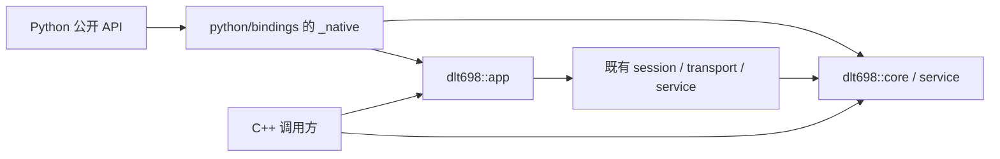

# Python 版本开发计划

编制日期：2026-10-07。状态：源码实现与本地验收已完成；完整平台矩阵、实机硬件及正式发布待外部验收。实现与操作说明见 [Python 文档](../python/README.md)，实际执行结果见 [验证记录](../python/verification.md)。C++ 源码和默认构建入口保持独立。

本计划落实三个要求：`python/` 与 `cpp/` 同级；Python 开发不影响独立 C++ 使用；两者共用内核、版本与发布提交，按重要性逐步开放接口。它细化并更新[总实现计划](implementation-plan.md)的 M10–M11 和第 6 节，普通入口以已实现的[应用接口计划](application-api-plan.md)及现有头文件为准。

## 1. 当前基础与开发原则

已核对仓库现状：

| 项目 | 当前情况 | Python 方案 |
| --- | --- | --- |
| 版本 | 根目录 `VERSION` 为 `0.1.0`，根 CMake 和独立 `cpp/` 构建均读取它 | 继续使用这一个版本源，不设 `python/VERSION` |
| C++ 组织 | `cpp/` 已有 core、session、service、transport、app 五个组件 | 直接链接现有目标，不复制协议实现 |
| 普通入口 | `app::Client`、`app::Server` 已管理运行线程、关联与收尾 | 优先绑定这两个入口，不要求 Python 用户手动驱动 Session |
| 第三方 | `third/pybind11` 已存在，头文件版本宏为 `3.1.0` | 使用仓库内版本，升级单独验证；C++ 默认构建不加载它 |
| 发布 | 已有统一标签 `vX.Y.Z`、十个 C++ 静态/动态包和草稿发布流程 | 增加联合制品门槛，不建立 Python 专属标签或版本线 |
| 测试依据 | `tests/vectors/`、C++ 分层测试与安装消费方测试已存在 | 共用独立规范向量，补绑定、安装与跨语言互操作测试 |

“完全对应”分成三项可验收约束：

1. **内核对应**：Python 调用同一提交的 C++ 编解码、会话和应用实现；不重写 CRC、APDU、分块、目录、状态机。
2. **语义对应**：已经开放的能力保留 C++ 的数据标签、字段、顺序、DAR、本地错误、默认值、资源限制和生命周期；Python 名称与异常风格可以适配。
3. **版本对应**：正式 C++ 包、Python 包、原生扩展和标签属于同一版本、同一发布提交。Python 单独修复也提升共享版本并重建双方制品。

阶段性开放允许 Python 接口数量少于 C++；所有未绑定能力必须登记为“待开放”。这与版本或语义漂移不同。某项 C++ 能力发生变化时，绑定和对应说明必须在同一变更中处理，不能长期沿用旧行为。

## 2. 目录与构建隔离

### 2.1 目标目录

```text
dlt698/
├── VERSION                         # 唯一发布版本源
├── CMakeLists.txt                  # 保持默认只构建 cpp
├── pyproject.toml                  # Python 打包入口与工具配置
├── cpp/                            # 现有 C++ 源码、测试、示例
├── python/                         # 与 cpp 同级的 Python 实现根目录
│   ├── CMakeLists.txt               # Python 独立 CMake 入口
│   ├── bindings/                   # pybind11 胶水代码，仍为 C++17
│   │   ├── module.cpp
│   │   ├── model.cpp
│   │   ├── codec.cpp
│   │   ├── app.cpp
│   │   └── errors.cpp
│   ├── src/dlt698/
│   │   ├── __init__.py             # 明确的公开导出与版本校验
│   │   ├── client.py
│   │   ├── server.py
│   │   ├── model.py
│   │   ├── codec.py
│   │   ├── errors.py
│   │   ├── _native.pyi             # 扩展模块的类型声明
│   │   └── py.typed
│   ├── api-map.json                # C++ / Python 接口及阶段对应清单
│   ├── tools/                     # 版本、对应关系及制品检查
│   ├── tests/                     # Python 与跨语言测试
│   ├── examples/                  # TCP、串口、读取与编解码示例
│   └── README.md                  # 安装、支持范围、生命周期说明
├── third/pybind11/                # 仓库已有第三方
├── third/asio/
├── tests/vectors/                 # 双方共用，不复制
├── build/                         # 所有 CMake 构建树
│   ├── python/                    # 按解释器/ABI/平台进一步区分
│   └── python-check-cpp/          # Python 变更后的独立 C++ 回归
└── plan/python-development-plan.md
```

根目录保留 `pyproject.toml` 是为了让 sdist 一次包含 `VERSION`、`cpp/`、`python/`、必要的 `cmake/` 和第三方源码。所有 Python 业务包装、绑定、测试和工具均在 `python/` 内；不把 Python 文件放进 `cpp/`。本目录树是实施目标，本次不提前创建空文件或占位模块。

### 2.2 依赖方向与构建入口



- 根 `CMakeLists.txt` 和 `cmake -S cpp` 均继续不查找 Python、pybind11 或 Python 打包工具。首期不向根构建添加默认启用的 Python 选项。
- Python 的 scikit-build-core 配置以 `python/` 为 CMake 源目录。该入口读取 `../VERSION` 设置项目版本，在自己的构建树通过 `add_subdirectory` 复用 `../cpp`，然后加载 `../third/pybind11`。
- 在 Python 专属配置中启用 transport、关闭 C++ 示例和测试、采用静态内核与 PIC；这些选项只作用于本次配置，不修改 `cpp/` 的选项默认值，不复用已有 C++ CMakeCache。
- 使用 `find_package(Python COMPONENTS Interpreter Development.Module REQUIRED)` 和 pybind11 的 FindPython 模式，解释器由构建后端指定；拒绝解释器与扩展架构不一致。
- 扩展链接 `dlt698::app` 及实际需要的组件，输出 `dlt698._native`。单独设置扩展的安装规则，不对其套用会覆盖模块输出目录的通用库设置。
- 为扩展、类型文件和许可证设置 Python 专属安装 component，由打包后端只安装该 component。现有 C++ `install()` 不变；wheel 不夹带 C++ SDK 的头文件、导出配置或独立库安装树。
- MSVC 绑定目标显式使用 `/utf-8`，并继承现有目标的 UTF-8 使用要求；采用 Release `/MD`，不混用 Debug ABI。不改核心的 PUBLIC 编译参数。
- Python 开发环境、工具缓存和构建产物使用忽略目录；编译扩展后才能做 editable 安装，不依赖手工设置 `PYTHONPATH` 伪装安装成功。

“不影响 C++”以独立构建、测试、安装和消费方运行通过为判断标准，不以目录隔离代替验证。若发现必须修改核心的问题，单独明确变更原因并进行 C++ 回归；不能为了绑定方便改变现有接口的含义。

## 3. 单一版本与防漂移机制

### 3.1 版本读取与导入校验

| 位置 | 来源与检查 |
| --- | --- |
| C++ `PROJECT_VERSION` | 根 `VERSION` |
| Python distribution metadata | `pyproject.toml` 声明动态版本，由后端读取根 `VERSION`；不硬编码版本 |
| 原生扩展 `build_info()` | 编译时生成的版本、发布提交、C++ 源码摘要和接口清单摘要 |
| `dlt698.__version__` | 来自 `_native`；与安装 metadata 及包装层生成的构建信息核对 |
| sdist / wheel | 制品检查读取 `PKG-INFO` / `METADATA`、包内构建信息和 native 信息 |
| Git 标签与发布清单 | `v` 加 `VERSION`，发布提交必须与制品记录一致 |

使用后端提供的动态 metadata 能力读取文件，生成信息写入构建目录或制品，不回写源码。后端能力和配置语法在 P0 用固定版本验证；sdist 构建也必须读取它自带的 `VERSION`。[scikit-build-core 动态 metadata 文档](https://scikit-build-core.readthedocs.io/en/stable/configuration/dynamic.html)。

正式版本沿用仓库现有严格 `X.Y.Z` 规则，首期不增加 Python 的 `.postN`、独立 rc 标签或另一套版本转换。示例中的 `0.1.0` 只表示当前基线；首次联合发布选用高于此前已正式发布版本的新共享版本。

正式制品由干净的同一提交构建。CI 在构建前生成发布提交与按相对路径排序的源码摘要：覆盖内核、必要 CMake 和被使用的第三方；该信息随 sdist 保留。sdist 无 `.git` 时使用随包信息并重新核对摘要，不借用构建机的其他 checkout 或已安装 C++ SDK。源码被改动却沿用旧摘要必须失败。本地开发可以明确标记 `development`，不能冒充正式发布制品。

导入时验证版本与包装层/native 的构建标识；发现旧扩展、错误 metadata 或混装构建，立即抛 `ImportError` 并说明差异，不继续运行。Python wheel 静态包含该提交的核心，不在运行时查找其他版本的 `dlt698.dll/.so/.dylib`。

### 3.2 接口对应清单

`python/api-map.json` 每项记录：能力编号、C++ 头文件/符号/签名、Python 路径/签名、阶段、状态、默认值及结果语义、依赖的数据类型、对应测试。状态使用 `exposed`、`deferred`、`internal`；待开放项注明原因和目标阶段，内部项注明不作为公开 Python 接口的原因。

清单在 P0 覆盖项目公开头文件中的能力、类型、枚举和配置；阶段表可以按能力组展示，但机器清单须落实到成员/重载。公开 C++ 头文件变化触发清单检查；采用编译器 AST 辅助比较已记录签名与新增/删除成员，绑定自身编译验证符号可用性。新增枚举值、默认参数和配置字段也纳入检查，不只检查函数名。

CI 必须验证：

- 已开放项存在实际公共导出、准确的类型声明、文档和对应测试；清单不能只标记完成。
- C++ 变化涉及已开放项时，同一 PR 同步绑定、错误映射、类型文件和测试。涉及待开放项时同步清单；Python 可继续暂缓开放。
- Python 新增协议能力必须指向已有 C++ 实现；Python 特有便利接口标为 `adapter`，写明组合关系，不能生成第二份协议规则。
- 签名和编译检查不能证明行为一致；行为差异由共用向量、边界用例和跨语言互操作验证。CI 提供防漂移门槛，不能声称自动证明所有语义。

## 4. 分阶段开放范围

### 4.1 优先级矩阵

| 阶段 | 公开能力 | 对应 C++ | 暂缓内容 |
| --- | --- | --- | --- |
| P0 工程基座 | 包导入、版本/构建信息、异常、接口清单、最小扩展、wheel/sdist 冒烟 | `VERSION`、`Error` / `ErrorCode` | 业务接口 |
| P1 首个可用版本 | `Client` / `Server`、TCP、简单串口、配置、状态、确定性关闭、普通 GET/GET List、服务器本地 `set`、Data 编解码、OAD、常用 Data 工厂、标准点位查询 | `app/client.hpp`、`app/server.hpp`、`app/connection.hpp`、`codec/data_codec.hpp`、`model/data.hpp`、`standard/catalog.hpp` | 客户端远端写入、ACTION、记录、Python 用户回调 |
| P2 写入与记录 | 客户端 SET/SET List、ACTION/ACTION List、OMD、记录/记录列表与选择器、Device 受控配置/共享、标准记录查询 | `app::Client`、`model/record.hpp`、`service/device.hpp`、`standard/records.hpp` | 任意 Python provider、REPORT、PROXY、SECURITY |
| P3 高级接入 | 诊断/流量/上报回调、动态 provider、REPORT、ThenGet、PROXY、安全后端配置、必要的低层专家接口 | 对应 session、service、security 与 protocol 头文件 | 未实现的自动恢复、未经验证的硬件保证 |
| P4 异步与扩展平台 | 基于同一异步核心的 `AsyncClient` / `asyncio`，按需求增加解释器 ABI 与平台 | 既有异步 Session / ClientService | 任何没有独立测试证据的支持声明 |

P1 先打通 TCP 读取闭环和安装验证，再加入简单串口、批量读取及目录查询；不以穷举底层结构体作为首版目标。P1 只读客户端足以用于采集和联调，服务器本地 `set` 用于发布/更新测量值，不能误称它已经允许远端协议 SET。

完整字格式、RS-485 排空/方向 hooks 和安全回调在 P3 随生命周期方案开放。P1 暴露基本地址、关联场景、各阶段超时、预算、设备布局及连接上限等可用配置；含 Python callable 的选项暂不开放。其余配置在清单逐字段列明，不通过“已绑定 Options”隐藏遗漏。

### 4.2 数据对应策略

- `Data` 保留原始协议标签。整数用显式 `Data.uint16(5000)` 等工厂；不从 Python `int` 猜测位宽或有符号性，`bool` 不被当作整数接受。
- 第一批工厂覆盖 null、boolean、各宽度有/无符号整数、enum、浮点、bit string、字符串、array/structure、OAD 及常用日期时间。更复杂的描述符工厂按 P2/P3 开放。
- **工厂分阶段，接收能力不能丢值**：P1 的通用 `Data` 必须持有 C++ 完整 Data，任何 C++ 当前支持的标签都可经 `decode_data` 创建、经 GET 返回并再次编码。暂没有专用访问器的复杂值仍可读取类型及编码后的 owning `bytes`，不转成 `None`、普通整数或“成功但缺失”。
- 复杂值的编码由 C++ codec 生成；测试比较语义、标签和规范预期字节，不把任意非规范输入原字节保留承诺为往返一致。
- OAD 的 attribute 保留完整字节及特征位，index 保留原值；数组和结构分别建模。日期时间保留 `FF/FFFF` 未指定字段，不强制转换成 `datetime` 或补时区。
- 标准点位、单位、倍率、布局和能力查询来自同一 C++ 目录。Python 不维护另一份 OI 表；首版返回协议原始值，工程单位转换后续作为显式适配功能。
- 字节输出使用 `bytes`。`bytearray` / `memoryview` 输入在进入异步或保存路径前复制；拒绝不符合契约的缓冲区，不让 C++ 保留 Python 的临时借用视图。

## 5. Python 公共 API 与现代工程规范

### 5.1 目标使用方式

以下为 P1 API 设计示例；当前实际签名以 Python 文档、公开类型声明与接口清单为准。类使用 PascalCase，函数和属性使用 snake_case。

```python
from dlt698 import Client, Data, Oad, Server

frequency = Oad(oi=0x200F, attribute=2, index=0)

with Server() as server:
    server.set(frequency, Data.uint16(5000))
    server.start_tcp("127.0.0.1", 0)

    with Client() as client:
        client.connect_tcp("127.0.0.1", server.local_port)
        result = client.get(frequency)
        if result.data is not None:
            print(result.data.as_uint16())  # 5000，单位为 0.01 Hz
        else:
            print(f"远端 DAR: {result.dar}")
```

`with` 创建并管理资源，不隐式建立连接；显式连接/启动成功后才能使用。`close()` 分别调用 C++ `disconnect()` / `stop()`；还保留对应原生名称及非阻塞 request 接口，并在清单标记别名关系。重复关闭幂等。退出 `with` 时没有业务异常则报告关闭失败；已有业务异常则保留原异常并附加关闭诊断，不覆盖最初错误。

### 5.2 返回值与异常

| 情况 | Python 契约 |
| --- | --- |
| Python 参数类型/取值错误 | `TypeError` / `ValueError` / `OverflowError`，先验证再调用 C++，不静默截断 |
| C++ `Result<T>` 成功 | 返回有类型的值；`Result<void>` 成功返回 `None` |
| GET 普通结果 | `ReadResult` 明确包含 `Data` 或原始 DAR，禁止两者同时存在或同时缺失 |
| GET List / 写入列表 | 保留顺序、项标识和逐项 Data/DAR；部分失败不自动回滚或合并 |
| SET / ACTION / 记录 | P2 保留 C++ 原始 DAR、可选 Data、列/行结构；不默认把非零 DAR 升格为本地异常 |
| 本地协议、校验、资源或 I/O 失败 | `Dlt698Error` 及分类子类，保留 `code`、`offset`、`context`、`remote_code` |
| 超时、取消、未关联、busy、关联拒绝、远端 ERROR | 分别映射明确分类，保留 C++ 原因；与业务 DAR 区分 |

`ErrorCode` 的每个当前枚举均须映射，新增值触发测试。`ReadResult` 可以提供显式 `require_data()` 便利方法，调用者选择后才将 DAR 转为带原码的异常。错误消息包含操作和字段上下文，不能只返回“失败”。超时/取消不代表远端 SET/ACTION 未执行；沿用 C++ 不自动重试有副作用操作的约定。

### 5.3 工程规范

- 使用 `src` 布局和 `pyproject.toml`，PEP 517 构建、PEP 621 metadata、明确 `requires-python`；开发依赖不作为运行依赖，不要求最终用户安装 pybind11。这些配置遵循 [Python Packaging 指南](https://packaging.python.org/en/latest/guides/writing-pyproject-toml/)。
- 首发支持目标为 CPython 3.11–3.14 的标准 GIL 构建；每个 minor 独立 wheel，不预设 abi3、PyPy、自由线程或子解释器支持。实施时再次验证工具链支持矩阵；新 minor 通过测试后随共享版本加入。
- 首发 metadata 使用 `requires-python = ">=3.11,<3.15"`；未验证的解释器/ABI 在导入或构建入口明确拒绝，支持范围与 metadata、文档和 CI 一致。增加支持版本时同步放宽范围。
- 公共 `.py` 有完整类型提示，扩展提供准确 `.pyi`，制品包含 `py.typed`，按 [PEP 561](https://peps.python.org/pep-0561/) 分发类型信息。用 mypy 检查公共示例和包装层，禁止用一片 `Any` 代替绑定契约。
- 使用 Ruff 检查与格式化 Python，pytest 执行测试；工具配置和已验证版本在 P0 固定，升级单独做回归。生成 stub 可以辅助起草，公开签名须人工核对并验证。
- 配置使用有类型的对象和明确单位，Python 超时参数统一为秒，适配到 C++ 毫秒时定义有限值、负数、零及精度规则；默认值来自清单，不自行更改核心默认值。
- 公共导出明确列入 `__all__`，`_native` 为私有实现模块；配置和值对象与活动连接分离，不允许修改属性绕过原生校验。
- 公共中文 docstring 说明参数、返回、异常、所有权、资源上限和生命周期。示例包含关闭及错误处理；库不配置全局日志、不在 import 时启动线程或联网。
- 绑定代码同样遵守仓库中文 Doxygen、关键实现中文注释及 UTF-8 要求；使用根 `.clang-format`，只格式化项目代码，不处理 `third/` 或生成目录。

## 6. GIL、线程与资源收尾

P1 不接受 Python 用户回调，也不开放 Python 子类 provider，优先降低跨线程生命周期复杂度。

1. 参数转换和返回对象构造持有 GIL；同步建连、读取、断开、停止及其他阻塞 C++ 调用期间释放 GIL。完成后重新持有 GIL，再转换 `Result` 和 Python 异常。无等待、无 Python 回调的短操作可保持 GIL。
2. 活动对象不复制，holder 和操作期间引用明确；返回 Data、事件和字节均拥有内存，不暴露裸指针或借用 C++ 内部字段。
3. 包装层不使用覆盖整个实例调用的 Python 锁串行化所有方法，防止读取阻塞时 `request_disconnect()` 无法执行。并发语义遵循 C++ 的单在途事务、busy 和启停约束。
4. `close()` 与析构收尾中不得持有 GIL 等待可能需要 GIL 的回调。确定性关闭是主要入口；回收/解释器结束只作为兜底，不承诺靠 `__del__` 执行业务操作。
5. P3 再引入受控回调分发：原生事件先复制到有界队列，由明确线程持有 GIL 调用 Python；禁止持有核心锁进入 Python，规定队列溢出、异常报告和取消规则。
6. P3 关闭顺序为停止新事件、解绑回调、关闭原生连接、收尾线程/分发器、在持有 GIL 时释放 Python 引用。关闭完成后不再调用用户 callback；有环引用、回调内关闭及最后引用释放都须测试。
7. 解释器 finalization 后不得新获取 GIL 进入 Python；若无法安全保证某个扩展点，则保持待开放。P4 `asyncio` 由原生异步完成投递到 loop，验证 loop 关闭及取消竞争，不仅给同步方法套线程包装就宣称异步对等。

GIL 与 Python 对象引用管理依照 [pybind11 官方说明](https://pybind11.readthedocs.io/en/stable/advanced/misc.html)，本项目另外以关闭、并发和进程退出测试验证具体实现。

## 7. 测试与 C++ 不受影响的验收

| 验证层 | 必测内容 | 放行条件 |
| --- | --- | --- |
| 独立 C++ | 原有根构建、`cpp/` 直构建、静态/动态、transport OFF、CTest、安装消费方 | 与 Python 配置隔离；C++ 不依赖 Python；原有测试通过 |
| 数据/编解码 | 共用 `tests/vectors/`，标签/数值边界、bool 与整数区分、截断、尾随数据、嵌套和预算 | 与规范向量及 C++ 行为一致；复杂 Data 无损承载 |
| 结果/异常 | 每个 ErrorCode、DAR、remote_code、批量部分成功、错误偏移 | 不混淆本地失败和远端结果 |
| 应用互操作 | Python client → C++ server、C++ client → Python server、Python 两端 | TCP 普通/列表 GET、更新可见性、默认场景及地址行为一致 |
| 生命周期 | 重复关闭、启动失败可重试、超时、并发取消、断线、服务器重启数据保留 | 无悬垂引用、死锁、残留线程；子进程限时退出 |
| 类型与格式 | Ruff、mypy、导出和 stub 核对、项目 C/C++ clang-format | 全部通过；新增绑定纳入格式检查 |
| 制品 | 仓库外新环境安装 wheel、sdist 无 Git 重建、版本/摘要核对、动态依赖审计、类型文件与许可证检查 | 不依赖源码树、开发机 PATH 或外部 C++ SDK |

差分测试辅助定位语言边界偏差，不能代替独立规范向量。进程退出、混装拒绝、GIL 并发取消等使用子进程和期限判断，不能以固定 sleep 或“本机没有卡住”作为通过证据。

真实串口/RS-485 必须单列硬件验证记录；无硬件时只能报告 API/模拟测试范围，不能把跳过用例计为通过。安全 mock 不等价于真实 ESAM 接入成功。

以下是实施后的验证命令，不表示本次已经运行或对应工具已经配置：

```powershell
# 独立 C++ 回归使用自己的构建目录
cmake -S cpp -B build/python-check-cpp -DCMAKE_BUILD_TYPE=Release
cmake --build build/python-check-cpp --config Release --parallel 2
ctest --test-dir build/python-check-cpp -C Release --output-on-failure

# 已激活 Python 开发环境，并安装已固定版本的开发工具
python -m pip install -e .
python -m pytest python/tests
python -m ruff check python
python -m ruff format --check python
python -m mypy python/src python/examples
python -m build  # 输出 sdist，并从 sdist 构建 wheel
```

格式检查从仓库根目录枚举 `cpp/` 和 `python/bindings/` 的项目 C/C++ 源码，以分批文件参数执行 `clang-format --style=file --dry-run --Werror`。第三方和构建生成文件排除。每个里程碑保存实际执行环境、用例和未验证范围。

## 8. wheel、sdist 与统一发布

### 8.1 分发方案

采用 pybind11 + CMake + scikit-build-core，使用 cibuildwheel 按解释器/平台构建并测试已安装的 wheel；具体工具链版本与修复命令在 P0 固定。cibuildwheel 提供跨平台 wheel 构建、安装测试及依赖修复入口。[cibuildwheel 官方文档](https://cibuildwheel.pypa.io/en/stable/)。

首发 wheel 目标与现有 C++ 平台对应：Windows x64 / MSVC、Linux x86_64 和 aarch64 / manylinux、macOS x86_64 和 arm64。macOS 延续 C++ 包的 11.0 部署目标；Linux manylinux 基线在构建验证后明确，Windows 沿用 `/MD`。按 CPython 3.11–3.14 计，目标为 20 个 wheel、1 个 sdist 及现有 10 个 C++ 包；最终数量从冻结的矩阵生成并检查，不永久硬编码。

某个平台暂未通过时，保持联合版本为候选，或在首次发布前统一调整支持矩阵并说明原因；不能让 C++ 正式前进到新版而 Python 停留在旧版。Python 的其他解释器/ABI、musllinux、Windows ARM64 等属于后续能力，不因构建工具支持就自动宣布项目支持。

sdist 白名单包含：根 `VERSION`、LICENSE、必要 README、`pyproject.toml`、`cpp/`、`python/`、`cmake/`、使用到的 Asio/pybind11、共用测试向量及测试所需 Catch2。排除 build、website、无关第三方、`.workbuddy/`、私有日志、`plan/*.pdf` 和本地脚本资料。检查实际压缩包内容，不只依赖 `.gitignore`。使用到的项目与第三方许可证随 wheel/sdist 交付。

### 8.2 联合发布门槛

P1 开始，正式发布统一遵循：

```text
冻结 VERSION、tag 和 commit
  → 独立 C++ 回归 + Python 格式/类型/对应关系检查
  → 同一 commit 构建 C++ 包和一个 sdist
  → 从该 sdist 构建完整 wheel 矩阵
  → 安装测试、版本/源码摘要/动态依赖检查
  → 汇总 release-manifest.json 与 SHA256SUMS
  → 上传同一个 GitHub Release 草稿
  → 全部制品齐全并校验通过后公开
```

扩展现有 `.github/workflows/release.yml` 的最终发布依赖和制品校验；新增 Python CI 负责日常检查，不能独立创建正式 Release。PR 和手动构建仍只产生候选 artifacts。发布清单包含版本、commit、各平台/解释器、文件哈希、绑定清单摘要及验证范围。

Python 单独 bugfix 同样提升根 `VERSION`，从新提交重建 C++ 和 Python；C++ 单独 bugfix 同理。禁止 Python `.post1`、移动旧标签、将不同提交的制品拼到同一版本。已公开制品不覆盖，修复需要新共享版本；失败仅重试同一提交的候选发布。

**首个联合版本以 GitHub Release 为统一正式入口，Python wheel/sdist 与 C++ 包一次公开。** 同时上传两个独立服务无法提供原子发布；为满足严格同步要求，首期不把 PyPI 独立上线作为正式入口。用户可以从同一 Release 下载匹配 wheel 后用 pip 安装。

PyPI 是后续分发阶段：先核查 distribution name 与发布账号，再配置 TestPyPI 和 Trusted Publishing，仅推广已经通过联合验证的同版本制品，不重新编译。届时必须明确跨服务存在可见时间差，并记录推广状态；如要求外部渠道任何时刻都同步，则继续使用唯一 GitHub Release 入口，不承诺跨服务原子性。

## 9. 执行顺序与里程碑交付

以验收条件推进，不把以下阶段直接绑定到预设发布日期。每个阶段可以拆 PR，但同一共享版本的正式发布不能跨过尚未通过的门槛。

| 里程碑 | 工作 | 必交付内容 | 完成标准 |
| --- | --- | --- | --- |
| M-P0 工程基座 | 建目录、冻结工具链/矩阵、动态版本、最小扩展、接口盘点 | pyproject、独立 Python CMake、build info、api-map、类型/格式配置、sdist/wheel 冒烟 | C++ 原有构建不查找 Python；离线源码结构完整；无 Git sdist 可构建；混装拒绝测试通过 |
| M-P1a 读取闭环 | Data/OAD/结果/异常、TCP Client/Server、关闭与基本配置 | 最小读取/发布示例、中文说明、规范向量及互操作测试 | C++/Python 双向 TCP 读取、标签/DAR 对应、退出与并发取消通过 |
| M-P1b 首版交付 | 简单串口、列表 GET、点位查询、wheel 矩阵、联合发布 | 安装文档、支持清单、全部类型文件、发布清单、SDK/wheel/sdist | 第 7 节门槛及完整支持矩阵通过；同版本同提交联合公开 |
| M-P2 写入与记录 | 远端写入/方法、记录查询、Device 配置和共享 | 参数/结果类型、授权与不重试说明、部分成功和分块用例 | 已开放能力与 C++ 对等；未开放高级能力清单准确 |
| M-P3 高级能力 | 有界回调分发、provider、REPORT/PROXY/安全/低层扩展 | 生命周期设计、队列策略、回调异常与关闭测试 | 无 GIL 死锁；关闭后无 callback；硬件/安全未验证范围明确 |
| M-P4 按需扩展 | asyncio、新平台/ABI、PyPI 推广 | 取消/loop 关闭测试、新增矩阵、渠道状态说明 | 不改变已开放同步语义；新能力与共享版本一起发布 |

### 实施清单

- [x] 完成 M-P0：独立 Python 工程、vendored pybind11、许可证和冻结工具配置。
- [x] 建立公开头文件/AST 盘点与 `api-map.json`，冻结 API、类型和错误契约。
- [x] 完成唯一版本、构建身份、sdist 白名单、无 Git 重建及混装拒绝检查。
- [x] 完成频率读取、批量读取、串口入口、目录、写入/方法、记录与共享 Device。
- [x] 完成受控事件、provider、MD5/ThenGet、REPORT、PROXY/透明桥、安全后端及 asyncio TCP。
- [x] 接入联合发布门槛和完整 CI 矩阵；任一语言制品缺失或身份不一致不能公开。
- [ ] 完整平台/解释器矩阵实际运行、实机串口/RS-485/ESAM 验收及首个联合版本公开。

当前源码交付覆盖上述必需实现，并完成本机可执行验收。按需新 ABI、异步串口、低层驱动 hooks 和 PyPI 推广保持待开放；平台与硬件目标不能仅凭 CI 配置算作已通过。
